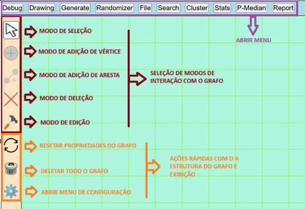
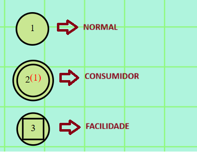
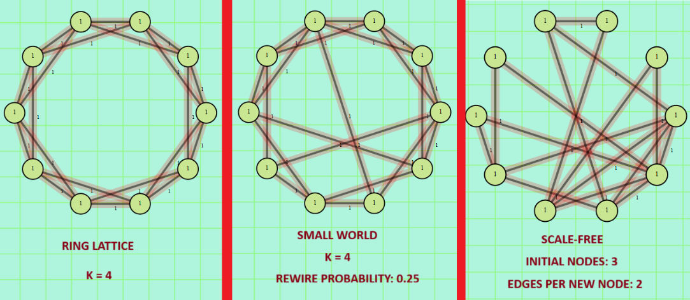
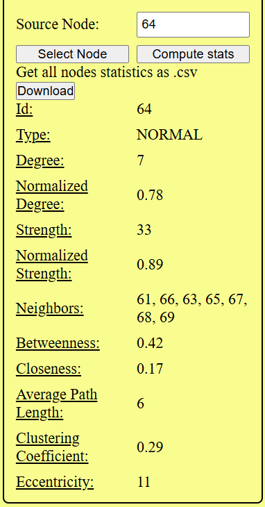
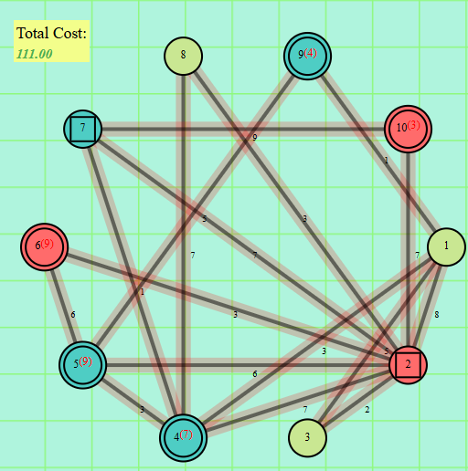

# Ariadne
Aplicação full-stack com Spring Boot (backend) e React (frontend) containerizada com Docker.
Ferramenta interativa para construção, geração, análise e cálculo de métricas de grafos e algoritmos p-median.

## Pré-requisitos
- [Git](https://git-scm.com/)
- [Docker](https://www.docker.com/get-started)
- [Docker Compose](https://docs.docker.com/compose/install/)

## Instalação e execução
```bash
git clone https://github.com/fefacio/ariadne
cd ariadne
docker-compose build --no-cache
dcoker-compose up
```

## URLS
- **Frontend (React)**: http://localhost:3000
- **Backend (Spring Boot)**: http://localhost:8080

## Aplicação

A aplicação desenvolvida é uma ferramenta interativa e extensível projetada para o estudo de grafos e do problema do p-median, permitindo aos usuários gerar, manipular e analisar diferentes configurações de rede através de parâmetros ajustáveis, bem como, calcular estatísticas e métricas relacionadas ao grafo.




A aplicação permite a geração de grafos aleatórios com número de nós e arestas configuráveis, oferecendo diferentes modos de geração de posições. No modo grid, os nós são distribuídos em grades quadradas ou retangulares e podem ser conectados aos vizinhos em direções horizontais, verticais e diagonais, possibilitando a criação de topologias controladas para experimentação. No modo ring, os nós são posicionados em formato de anel, sendo possível gerar diferentes tipos de redes, como ring lattice, small-world, scale-free e Erdős–Rényi.


Além disso, a aplicação também realiza o cálculo de diversas estatísticas e métricas relacionadas tanto à estrutura global do grafo quanto às propriedades individuais de seus nós. Esses resultados podem ser posteriormente utilizados para análises quantitativas e comparativas. As métricas selecionadas constituem as principais propriedades de um grafo, bem como medidas de centralidade.


Para a resolução do problema do p-median, foram implementados dois algoritmos heurísticos clássicos: o algoritmo guloso (KUEHN; HAMBURGER,1963) e o método Interchangede (TEITZ; BART, 1968). Além disso, foi desenvolvida uma variação híbrida que integra o processo de clustering, na qual o número de clusters é igual ao número de instalações, e, dentro de cada grupo, selecionam-se os nós com menor distância média aos consumidores para se tornarem instalações.
